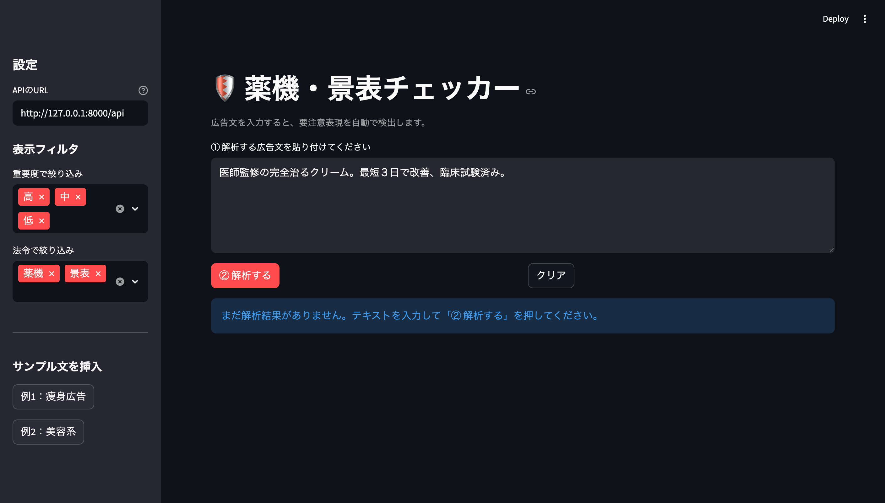
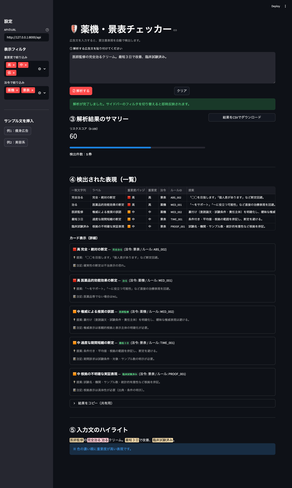
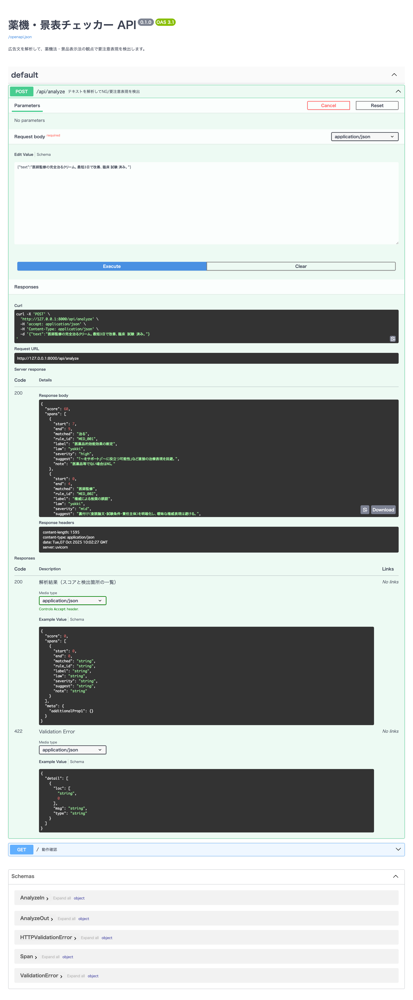

# 薬機・景表チェッカー (Yakkihou Checker)


広告文を解析し、**薬機法/景品表示法**の観点で要注意表現を検出するツールです。  
FastAPI で API、Streamlit で **日本語UI** を提供します。

---

## 主な機能

- YAMLルールに基づく NG 表現検出  
  （例：絶対表現 / 医薬品的効能の断定 / 過度な期間短縮 / 根拠不明 など）
- スコア算出・検出一覧（表 / カード）・**テキストハイライト**
- 結果を **CSV ダウンロード**（BOM付き UTF-8）
- Swagger UI (`/docs`) で API 試験可能

---

## 📸 デモ画面

### Streamlit UI

*広告文を入力して解析を実行*

### 解析結果

*NG表現の検出結果とリスクスコア*

### API ドキュメント（Swagger UI）

*FastAPI による自動生成されたAPI仕様書*

---

## 技術スタック

- Python 3.11+
- FastAPI / Uvicorn
- Streamlit
- Ruff / mypy / pytest

---

## セットアップ

### 前提条件

- Python 3.11以上がインストールされていること
- Gitがインストールされていること

### インストール手順

```bash
# 1. リポジトリをクローン
git clone https://github.com/SE0831/yakkihou-checker.git
cd yakkihou-checker

# 2. 仮想環境を作成
python3 -m venv .venv
source .venv/bin/activate  # Windowsの場合: .venv\Scripts\activate

# 3. 依存パッケージをインストール
pip install -r requirements.txt
```

---

## 起動方法

このプロジェクトは2つのコンポーネントで構成されています。

### 1️⃣ FastAPI（バックエンドAPI）

**ターミナル1** で以下を実行：

```bash
source .venv/bin/activate  # 仮想環境を有効化（Windowsの場合: .venv\Scripts\activate）
uvicorn app.main:app --reload
```

起動後、以下のURLにアクセスできます：
- **API ドキュメント（Swagger UI）**: http://127.0.0.1:8000/docs
- **API エンドポイント**: http://127.0.0.1:8000/api/analyze

### 2️⃣ Streamlit（フロントエンドUI）

**ターミナル2**（別のターミナルウィンドウ）で以下を実行：

```bash
source .venv/bin/activate  # 仮想環境を有効化（Windowsの場合: .venv\Scripts\activate）
streamlit run ui/app.py
```

起動後、以下のURLにアクセスできます：
- **Web UI**: http://localhost:8501

---

## 使い方

### Web UI での利用

1. ブラウザで http://localhost:8501 を開く
2. テキストエリアに広告文を入力
3. 「解析実行」ボタンをクリック
4. 検出されたNG表現と改善提案を確認

### API での利用

```bash
curl -X POST "http://127.0.0.1:8000/api/analyze" \
  -H "Content-Type: application/json" \
  -d '{
    "text": "必ず痩せます！医師推薦の最高品質です。"
  }'
```

**レスポンス例**:
```json
{
  "text": "必ず痩せます！医師推薦の最高品質です。",
  "risk_score": 25,
  "risk_level": "high",
  "total_violations": 3,
  "violations": [
    {
      "rule_id": "ABS_001",
      "label": "絶対表現",
      "law": "keihyo",
      "severity": "high",
      "matched_text": "必ず",
      "suggest": "「〜を目指します」など確実性を避けた表現に変更してください。"
    }
  ]
}
```

---

## プロジェクト構成

```
yakkihou-checker/
├── app/
│   ├── main.py              # FastAPI エントリーポイント
│   ├── nlp/
│   │   ├── checker.py       # チェックロジック
│   │   └── rules/
│   │       └── ng_rules.yml # NGルール定義
│   └── ...
├── ui/
│   └── app.py               # Streamlit UI
├── tests/
│   └── test_checker.py      # テストコード
├── requirements.txt
├── LICENSE
└── README.md
```

---

## テスト

```bash
# テスト実行
pytest

# カバレッジ付き実行
pytest --cov=app --cov-report=html
```

---

## ライセンス

MIT License - 詳細は [LICENSE](LICENSE) をご覧ください。

---

## 作成者

**SE0831**
- GitHub: [@SE0831](https://github.com/SE0831)

---

## 注意事項

⚠️ このツールは一次チェック用です。最終的な法的判断は必ず専門家にご相談ください。